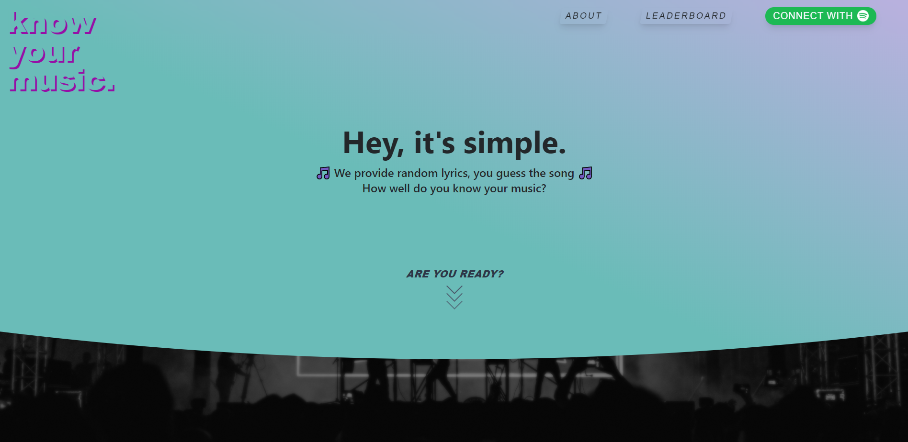
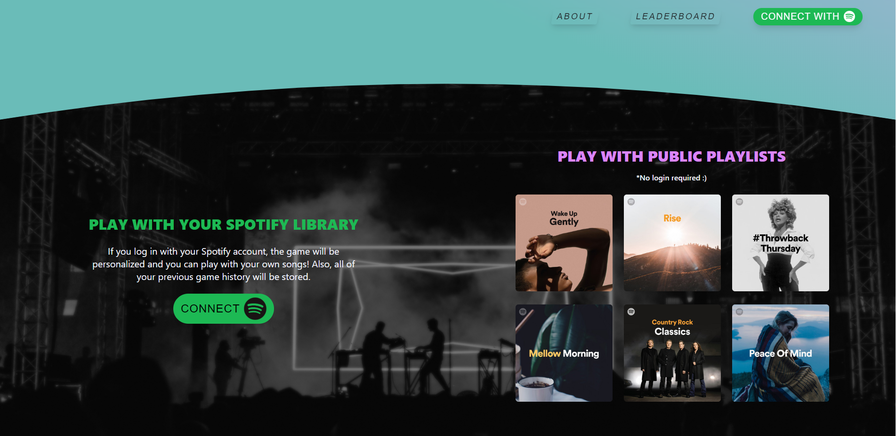

# KnowYourMusic - _UNDER CONSTRUCTION_





# Introduction

KnowYourMusic was initially developed as a end-of-year portfolio project at Holberton School.

We all like singing to our songs. However, most of the time we don't really know the lyrics to the songs were singing. One solution would be to read song lyrics all day util we memorize them, but that wouldn't be very fun.. That's why you should play KnowYourMusic!

A game that determines how well you know your music. Login with your Spotify account and play with your own library, or play with one of the weekly public playlist (no login needed). See how many songs you can guess right!

Game data and basic user data is stored for a full user experience.

# Getting Started 👇

These instructions will get you a copy of the project up and running on your local machine for development and testing purposes.

## Requirements

For development, you will only need Node.js and a node global package, npm, installed in your environement.

```
$ node --version
v8.11.3

$ npm --version
6.1.0
```

## Installing

```
$ git clone https://github.com/ethanpasta/KnowYourMusic
$ cd KnowYourMusic
$ npm install && cd client && npm install
```

## Deployment 🔥

`npm run dev` (`dev:client` for client only and `dev:server` for server only)

# Authors 🙋

-   **Eitan Mayer** - [LinkedIn](https://www.linkedin.com/eitanmayer) | [Twitter](https://twitter.com/eitanmayer57)
